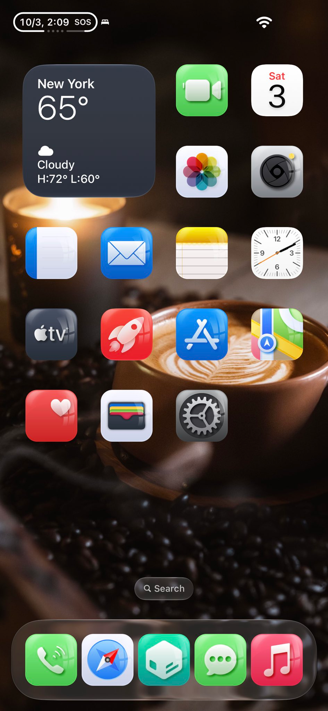
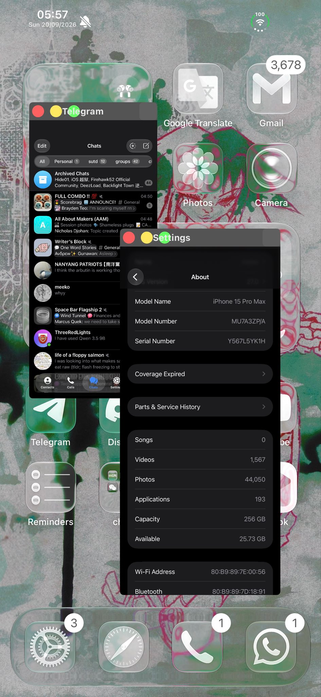

<style>
img {
    display: block !important;
    max-width: min(100%, 600px) !important;
    width: auto !important;
    height: auto !important;
    margin: 1rem auto !important;
    border-radius: 8px;
    box-shadow: 0 2px 8px rgba(0, 0, 0, 0.1);
}

@media (max-width: 600px) {
    img {
        max-width: 95% !important;
        max-height: 300px !important;
        object-fit: contain !important;
    }
}
a {
    word-wrap: break-word !important;
    display: inline-block !important;
    max-width: 100% !important;
    overflow: hidden !important;
    text-overflow: ellipsis !important;
}
</style>

I'm writing this blogpost as the TSS bug has been patched, but basically, I wrote Lycorine. it's an on app jailbreak installer that takes advantage of the fact that Apple fucked up with their SRD program. It let anyone sign + personalise their trustcache with ANY binary, ANY entitlements, and with TL8. it's TrollStore on ultra steroids, and because it's Not Technically an exploit, it's really funny. So, what's the logical extreme you could do with only a "static" codesigning bypass?

## recap
Back in 2022, Apple introduced a Security Research Device program. It claimed many things then on its [page](https://support.apple.com/en-sg/guide/security/seca7ff718d2/web), many of which are... questionable... but its main purpose is to provide approved security researchers with a phone that has a few escape hatches to let researchers load in unsigned code, kernelcaches, boot args, etc. without any problems. how it does the unsigned code part is mainly via Cryptexes. it claims that:

* launchd doesn't load cryptexd on prod iphones (false)
* cryptexd aborts if it detects a normal prod device (false)
* `AppleImage4` doesn’t vend the anti-replay value used for verifying a research cryptex on a normal customer device. (??? not sure, can't verify client side)
* **The signing server refuses to personalise a cryptex disk image for a device not on an explicit allow list. ... ???**

so now we get to the main part. how is this related to regular iphones?

recall that most jailbreaks have 2 main hurdles to defeat. the first is codesigning. the 2nd is what you have to do to defeat it (eg. krw, memory protections, SPTM, MTE). On the latest versions of iOS, a lot of it has been moved from the kernel and migrated to an "exclave", aka TXM. it's irrelevant to this, but basically just know that to get code with your own entitlements to run, you must either be an App Store signed app, or be in a "trustcache" of high enough trust level. 

Trust levels determine whether your entitlements are allowed to run, whether you're allowed to debug platform binaries, etc.

A trustcache in this case is a collection of CDHashes, which are submitted to AMFI. A CDHash is a CodeDirectoryHash which consists of a hash of the CodeDirectory of a binary. When a binary is attempted to be run, it checks things in this order:

1. i call /bin/bash. kernel/AMFI checks for me, the CDHash of it is compared against a static and dynamic trustcache. it's not there. still ok!
2. i ask mr CoreTrust:
	* hi help me validate if this is from the app store, if it is then chill and we let it run
	* it says ok lemme do my thing
3. if not, proceed to amfi / TXM, which then checks if it's a developer app or other. if not, DIE. SIGKILL CODESIGNING :D 
## the bug
* Security Research Devices are supposed to be the only consumers of this, but obviously this wasn't the case. what ended up happening was that you could create your own bundled cryptex image, and just ask Apple to sign your personalised image! and they just said OK. so .... ??? great??
* what problems are there with this?

so, remember that CDHashes and dynamic trustcaches are "static" (eg. once i load them, i can't run binaries with CDHashes not in them). if i download a new binary or tweak, it won't run without me creating a trustcache and asking apple nicely with my "SRD" to sign it :c so this is really really unsustainable. there is a way around this, but it's really annoying. 

## step 1: installer
i wanted to make an app installer, so this would come in 2 distinct steps. and they're pretty divorced from each other for a good reason. but anyway, to get my code to start running, i'd have to install it. 

most other solutions i've seen involved just a python script on a mac or an app that uses pymobiledevice3's cryptex APIs. i wasn't that satisfied w that. i wanted everything to be in app and pipe output. are there any bindings for this?

option 1. use pymobiledevice3 and loopback on device. fuck python, no thanks
option 2. use idevice, a rust->swift bindings library that loopbacks on device. also used by Feather and Stikdebug. all it needs is a pairing file, which are easily accessible via Linux, and only 1 time generated. so sounds like a pretty good tradeoff!

so the app currently takes a prebuilt cryptex image, and asks Apple nicely to sign our personalised cryptex :) pretty please !! Apple obliges, and we run idevice bindings to install. yippee :D now we have an autorunning root binary, and no way to IPC! which comes to...

### RootHelper
to have something more privileged to untar, run binary patching, copying, etc. the app isn't entitled enough as a regular developer app. but you know what is?! that's right. a roothelper!!

originally from TrollStore, the point of a root helper is to spawn it (with an action or some way to tell it what to do), and it logs and reports it back to the app.
recall that the app has no special entitlements outside of a developer app. no XPC, mach messaging, nada. 

the only thing i came up with was using the Documents folder as an inbox. it's really dogshit, but it works... if there's a better way please do let me know :)

anyway,  so the flow is:
* roothelper spawns, watches document folder
* receives plist with action
* does thing, pipes output to document folder: app pipes it to stdout

The previous method that Serotonin used involved injecting / redirecting spawn of launchd, then subsequently hooking spawns from there. The concept here is not so different. 
Hence, the roothelper here has to:
1. copy SpringBoard / other binaries
2. resign them with get-task-allow (mainly, but other ents like unsandboxing may fuck up some daemon permissions)
3. insert `LC_LOAD_DYLIB` load command with a hook (generalhook.dylib) to do stuff csops fixing, cs_allow_invalid pages, and also bypass dyld library validation if the goal is to allow arbitrary dylib loading post-patch
4. get posix_spawn(p) to hook said spawns.

This was my initial method eg. inserting a load command for LC_LOAD_DYLIB, but the problem here is that there just simply isn't enough space in the load command section. it depends on binary to binary whether i could get rid of some framework load command, or get rid of the code signature and resign, and it was just really fucking annoying to work around because it felt very binary dependent.

How would i do this without making a YandereDev-tier if-else statement? the name of the game is to Generalise. Recall that on `*OS`, DYLD_INSERT_LIBRARIES is a really cool environment variable. Pass the path of a validly signed dylib in and run a binary, and dyld will happily dlopen it for you without any trouble. No need for binary patching yippee!! Unfortunately, it's ignored on iOS by default. It is def possible to just patch dyld. Dopamine does it with fakelib and bind mounting, why not us as well??

Nathan(LR) pointed out to me that a fork of Dopamine for "AI" devices also does use a dyld patch. this is where our next step comes in :3 
## step 2: faked
In order to bind mount, you HAVE to be initproc, and you have to have a very specific entitlement `com.apple.private.bindfs-allow` . The problem is uh... launchd doesn't have that entitlement! bit of a catch 22 here. the solution, of course, is to just make our very own initproc :D we'll call it faked. its job is really simple:

1. bind mount `/var/jb/basebin/gen/dyld.patch` over `/usr/lib`
2. spawn our patched launchd with a load command into launchdhook. really weird waltz i guess

the code is here: 
```c
int main(int argc, char *argv[], char *envp[]) {
    FILE *file = fopen("/var/jb/faked.log", "a");
    if (getpid() == 1) {
        if (file) {
          fputs("[faked] You're closed in, I'm awake / I'm open, you're asleep\n",
                file);
          fflush(file);
        }
    }
.// ..snip
    mount("bindfs", "/usr/lib", MNT_RDONLY, "/var/jb/basebin/.fakelib");
    if (file) {
        fputs("[faked] executing launchd clone\n", file);
        fflush(file);
    }

    argv[0] = "/sbin/launchd";
    posix_spawnattr_t attr;
    int r = posix_spawnattr_init(&attr);
    if (r == 0)
        r = posix_spawnattr_setflags(&attr,
            POSIX_SPAWN_SETEXEC | POSIX_SPAWN_CLOEXEC_DEFAULT);
    pid_t pid = 0;
    if (r == 0)
        r = posix_spawn(&pid, launchd_paths.executable, NULL, &attr, argv,
                        envc);
    if (file) {
        fprintf(file, "[faked] launchd clone exec failed: %d (%s)\n", r,
                strerror(r));
        fclose(file);
    }
    return 127;
}
```

## step 3: hooks
> Open the curtains / Lights on / Don't miss a moment of this experiment

### launchdhook
ok so now it's time to do the userspace reboot
first, launchdhook has to redirect its own spawn of "/sbin/launchd" to faked. so opainject 1 <pathtodylib/>, and this rebinds posix_spawn and hooks new spawns to faked.

On respawn, launchdhook is reloaded. it rebinds everything again, and mainly just starts to redirect posix_spawns from /xxx/SpringBoard, or /usr/libexec/xpcproxy -> /var/jb/usr/libexec/xpcproxy, etc. of which all of them were previously already copied by the roothelper and trustcached :D 

the xpcproxyhook spawns other processes, so it has to have its own posix_spawn hook which does the same thing essentially

### generalhook
This hook is injected into every process. The point of it is to just be simple. set up an environment for ellekit to be dlopen'ed to load in unsigned, arbitrary tweaks. of course, the generalhook itself is trustcached, so that isn't a problem.

**JIT / CS_DEBUGGED**

Recall that previously, JIT / allowing invalid pages could be achieved by just fork()ing, or spawning yourself, or XPC messaging another daemon. All of which will receive the message, call `PT_TRACE_ME`, and detach. I thought this would work the same way, but nope!! i tried the same snippet and it decided to blow itself up.

```
default    02:30:32.948353+0800    kernel    /private/var/containers/Bundle/.jb/System/Library/CoreServices/SpringBoard.app/SpringBoard[6871] ==> (apply-protobox)
error    02:30:32.975372+0800    kernel    Protobox: SpringBoard(6871) deny(1) process-exec* /private/var/containers/Bundle/.jb/System/Library/CoreServices/SpringBoard.app/SpringBoard
default    02:30:32.979748+0800    SpringBoard    meowmeow generalhook - inited 6871
default    02:30:32.979935+0800    kernel    vm: SpringBoard[6871] triggered unnest of range 0x196000000->0x198000000 of DYLD shared region in VM map <decode: bad range for [%p] got [offs:12 len:0 within:0]>. While not abnormal for debuggers, this increases system memory footprint until the target exits.
default    02:30:32.982527+0800    kernel    SpringBoard[6871] Corpse allowed 1 of 5
```


Why?? Because of Protobox!! More restrictions 🤩... what exactly is Protobox??

**wtf is protobox**
checking the crashes and console logs, it becomes quite evident what's happening in SpringBoard. Protobox is blocking A LOT of things. mainly:
1. you can't exec anything, not even yourself. so the previous snippet to jit yourself isn't gonna work :c 
2. protobox also blocks mach messages. 

to dump a protobox of a binary, you can use `ipsw` to do so:
```bash
ipsw sb dec <pathtokcache> SpringBoard --type protobox
```

and here you see it just lowkey wants to slime u out:

```
...snip
(deny process-exec*)
(allow process-exec*
        (require-any
                (literal "/bin/bash")
                (literal "/bin/kill")
                (literal "/bin/mv")
                (literal "/bin/rm")
                (literal "/bin/sh")
                (literal "/usr/bin/atos")
                (literal "/usr/bin/log")
                (literal "/usr/bin/pkill")
        )
)
snip...
```

what a wonderful time to jailbreak :P 
there are a few ways to get around this. which are mainly:
1. rename the binary (my initial solution! it worked fine with self jit)
2. give it another sandbox profile
3. don't get around it! jit it at spawn time instead with launchdhook!!

wait wait wdym by jit it at spawn time?? how dat work?

i've created a jit daemon, and so the easiest solution is:
1. spawn hooked stuff suspended
2. mach msg jitterd to ptrace and detach
3. unsuspend

there we go! no weird behavior in generalhook. everything's enclosed to the launchdhook :D 

code is here: https://github.com/hrtowii/lycorine/blob/main/Lycorine/Bundled/Hooks/Shared/Spawn/jit_spawn.c

you might notice that xpcproxy here isn't jitted at spawn. that's because jitterd is spawned by xpcproxy, so it'll deadlock and blow up if i don't skip it. and besides, xpcproxyhook doesn't need invalid pages :P all that's needed is to route spawns, which something rebinding with litehook can do easily. the only thing that launchd does for that is redirect its spawn, and give it its send port. this allows xpcproxy to jitterd stuff that ITSELF spawns.


**dyld library validation bypass**
dyld isn't stupid. why the hell would it just let any dylib run in a process?? surely it has some mitigations, you ask. or maybe i'm asking on behalf of you. anyway the point is that it does! it's called library validation. dyld will check if the team id of the dylib that is trying to be run is the same as the app being run. Previously, with the CoreTrust v2 bypass, every binary was resigned with GTA 5 tracker's certificate and team id, so it was never really a problem. However, unsigned dylibs don't! how is there a way to get around this?

fortunately, the goat Duy Tran has gotten around this before with LiveContainer / Amethyst. What it does is that, based off a blogpost from xpnsec [here](https://blog.xpnsec.com/restoring-dyld-memory-loading/), dyld is actually locally mapped into every process at its header. it's thus possible to patch it per process (with Copy On Write)! the src is [here](https://github.com/AngelAuraMC/Amethyst-iOS/blob/main/Natives/dyld_bypass_validation.m) . essentially, what it does is that it patches fcntl and mmap to do 2 things:

1. if mmap, try doing original behavior. If it fails, map in private and anonymous pages, then return them.
2. if it's fcntl, if it's the `F_CHECK_LV` syscall by dyld, just lie and tell dyld that everything is fine. After which, everyone is happy :D 

## step 4: tweaks!!
* this part is really simple. just dlopen ellekit, and the hooks we installed previously will ensure that 
	* invalid pages will run without faulting and blowing up
	* dylibs will load in without failing library validation :D 

my fren GenericCoding and I had some dope shit :> 





## step 5: fixing up broken shit
while doing all of that shit, i was also concurrently trying to figure out how to get launch daemons from my cryptex to restart on userspace reboot. I dunno if it's like some kind of bug, but cryptexes just do not get mounted At All after a userspace reboot. like hell, cryptexd itself doesn't restart so idk why LMFAO

i tried a few things to fix this, which were all pretty unsuccessful
1. reverse cryptexd and try reimplementing how it submits jobs to launchd. OSLaunchdJobSubmit or sum api like that just refused to fucking work, so too bad LOL IUASHNDIAUSDB
	1. on a side note, their function naming is super funny. like the renaming of the root to be a cryptex-relative root is known as "frobnicating". so /Library/LaunchDaemons becomes /private/var/mnt/cryptexd/<bundleid/>.t12xZx/Library/LaunchDaemons. why is it called frobnicate? who knows brah
2. try copying the binaries from the cryptexd mount before userspace reboot, and set that !! as the cryptex root! but no didn't work

the last solution that DID work was `xpc_get_dictionary`, which i hooked initially in launchd. after that, it was easy to submit the XPC dictionaries by manually walking /var/jb/Library/LaunchDaemons and submitting them Properly this time whenever the key is "LaunchDaemons".

## why wasn't this released??
ok, so i had a lot of discussion / arguments between people who knew of the bug. the decision matrix that i ended up on was like this:

either people who know it all agree to not release it, and it gets patched. we enjoy it for ourself

people know it all agree to release it. we race against time to get a proper polished release. it's probably possible to have saved cryptex tickets as well to "replay attack"? (unsure) and allow maybe a 2 hour window of people to jailbreak. everyone gets pissed that we burned the bug

people don't know about it, everyone's happy. ignorance is bliss :)

or the worst ending: everyone enters a race to release first, and everyone gets a shitty / non-functional not-jailbreak :c which was what i was tryna avoid

in the end, we chose option 1. i wasn't particularly happy about it, because the thing is that cryptexes are untethered until you OTA update or purposely unmount it... it'd have been a chance to give a few people untethered jailbreaks for a while :c 

it's why i'm making the blogpost about it now :P I do regret that i couldn't properly get unsigned apps / tweaked apps to properly run and redirect, but i think getting launch daemons running and unlimited tweaks on SpringBoard is good enough :) 

update: i'm not gonna release the code used for actually signing the cryptex in the repo for security, but the repo otherwise is available. check it out [here](https://github.com/hrtowii/lycorine-public)
