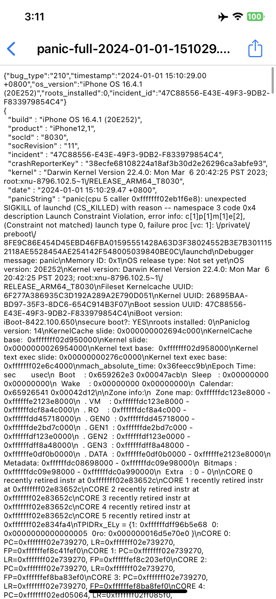
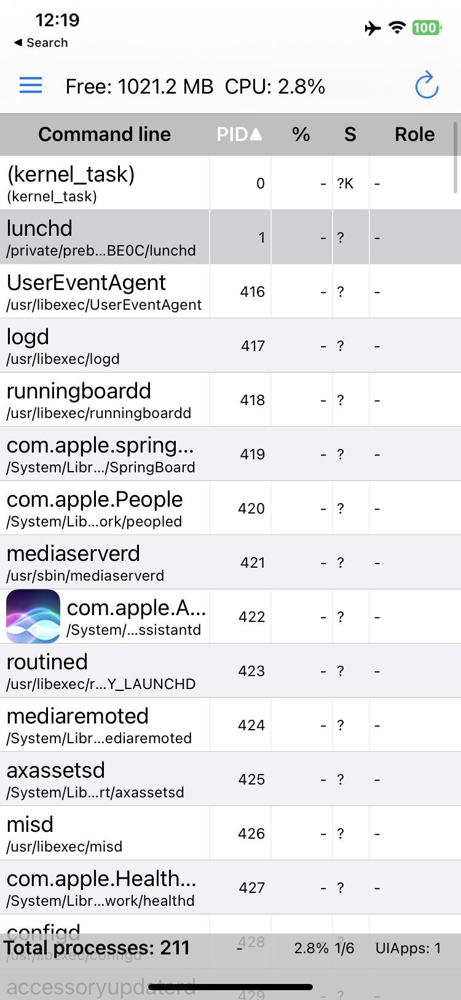
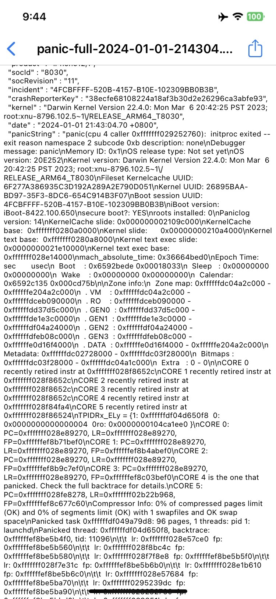
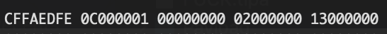
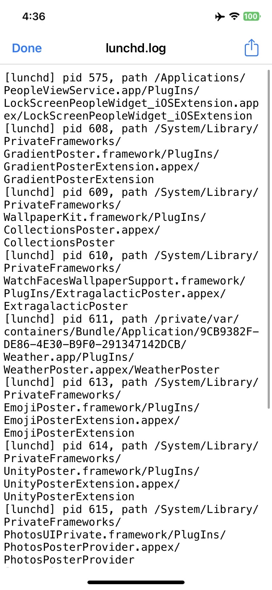
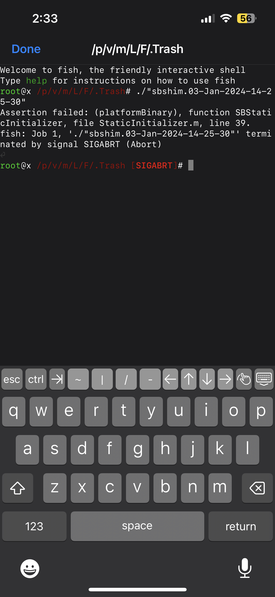
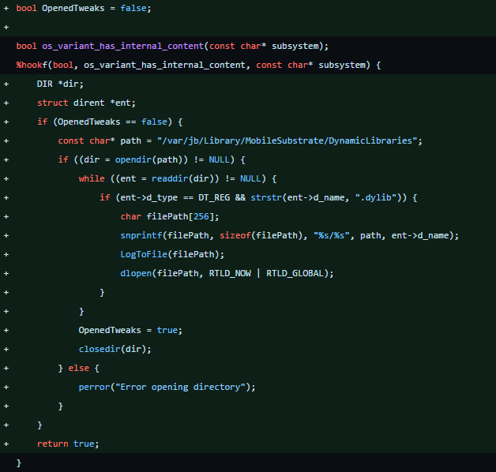

<style>
img {
    display: block !important;
    max-width: min(100%, 600px) !important;
    width: auto !important;
    height: auto !important;
    margin: 1rem auto !important;
    border-radius: 8px;
    box-shadow: 0 2px 8px rgba(0, 0, 0, 0.1);
}

@media (max-width: 600px) {
    img {
        max-width: 95% !important;
        max-height: 300px !important;
        object-fit: contain !important;
    }
}
a {
    word-wrap: break-word !important;
    display: inline-block !important;
    max-width: 100% !important;
    overflow: hidden !important;
    text-overflow: ellipsis !important;
}
</style>

# Introduction

One fine week in January 2024, I released a semi-jailbreak named [Serotonin](https://github.com/hrtowii/Serotonin). If you're unaware of what it does, it aims to enable tweak injection for SpringBoard and works with the RootHide bootstrap. I never really explained how it worked and why I view it as a failure, so this blog post aims to cover that. Let's go over what led up to the release, how I made it, and how I'd have made it now if I didn't rush it out.

Disclaimer: I did not do this alone. I have gotten countless amounts of help from very patient people, and I would not be able to make this without them.

<!-- # Background: What's a semi-jailbreak? -->

## What does a jailbreak need?

Traditional jailbreaks typically involve running exploits to ultimately defeat codesigning in order to inject dylibs into them for tweaks.

In Dopamine 1 (v2 wasn't out yet), this was achieved by using the [Fugu15 exploit chain](https://objectivebythesea.org/v5/talks/OBTS_v5_lHenze.pdf), which consisted of a DriverKit kernel exploit, a CoreTrust+installd bypass, a PAC bypass, and a PPL bypass.

Do you spot the problem here? There are just too many exploits needed to be chained together. How do we get around this?

**Let me ask you:** What do you _really_ want from a jailbreak?

Is it the ability to run arbitrary binaries? To get a root shell? To get cool icons on your homescreen? If all you really want is that, you don't even need systemwide injection, just SpringBoard injection. This is exactly what a "semi-jailbreak" aims to be. Note that I'm just making this shit up, the terminology isn't exactly set in stone.

### kernel r/w

To read and write to kernel memory, a kernel exploit is needed.

I could write another blogpost on how \*OS kexploits have evolved throughout their versions, but the gist is that vulnerabilities present in the _virtual memory layer_ of the kernel have a lot more mitigations than bugs affecting the _physical memory layer_ only. This is evident from recent kexploits abusing [physical use-after-frees](https://github.com/felix-pb/kfd/blob/main/writeups/exploiting-puafs.md) and the last virtual memory exploit being [multicast_bytecopy](https://github.com/potmdehex/multicast_bytecopy) and [weightBufs](https://github.com/0x36/weightBufs) which only work up to iOS 15.

[kfd](https://github.com/felix-pb/kfd) is a set of kernel exploits that mainly work from iOS ???-16.6.1. landa is the most recent version that works up to 16.6.1, and doesn't require any cleanup on exploit failure. This makes it the best version in terms of both reliability and version support.

### Codesigning bypass

Codesigning is an essential part of the iOS security model that ensures that random binaries can't run with arbitrary entitlements. For more info on this I recommend reading [the Apple Wiki article](https://theapplewiki.com/wiki/Code_signature) and [this article from Alfie](https://alfiecg.uk/2024/01/06/Ad-hoc-signing.html).

What's relevant here is that CoreTrust has a vulnerability that allows us to run any binary we want with arbitrary entitlements (barring 3). This is because CoreTrust was recently changed to fast track binaries to be run without any further checks if it reports that it's from Apple. By itself, this is pretty useful (see TrollStore, Bootstrap).

# The idea: Replacing launchd to win

`launchd` replacement has always been viewed as a "holy grail" in the sense that running arbitrary code in it allows us to hook every other spawn function, as every process that's spawned in iOS userspace has to go through its `posix_spawn()` function.

If we could replace launchd with our own using the CoreTrust bypass, it'd be game over. This has been demonstrated using [asdfugil's haxx](https://github.com/asdfugil/haxx/launchd.c) if you just replace the original `/sbin/launchd` binary on iOS 14-14.8.1. A related article from Alfie is [here](https://alfiecg.uk/2023/02/25/Getting-untethered-code-execution-on-iOS-14.8.html) which talks about it.

However, the introduction of SSV on iOS 15 ([Signed System Volume](https://support.apple.com/en-sg/guide/security/secd698747c9/web)) aka. Rootless (not to be confused with SIP) prevents us from doing that on newer versions of iOS.

Could there still be a way to replace files, temporarily or not, without breaking SSV?

If so, we could get a semi-jailbreak to work by hooking `posix_spawn()` and making it spawn our own SpringBoard. Not only that, but it could be used to replace any system binary we please because it's all CT signed.

# Getting it to work

## launchd control first

### Idea: MacDirtyCow / kfd

MacDirtyCow (MDC) is a unique kernel exploit in the sense that it doesn't grant krw, but overwrites arbitrary files, similar to the dirty COW exploit on Linux. It only works up to 16.1.2, which hinders version support

Similarly to MacDirtyCow, kexploits such as kfd can also overwrite files temporarily. I've demonstrated this with my [fork of WDBFontOverwrite](https://github.com/hrtowii/WDBFontOverwrite/blob/main/WDBFontOverwrite/fun/thanks_opa334dev_htrowii.m#L171). Good thing that kfd supports up to 16.6.1!

As a plus, changes get reverted on reboot because of SSV. A great example of what MDC can do is [grant_full_disk_access.m](https://gist.github.com/zhuowei/bc7a90bdc520556fda84d33e0583eb3e), which overwrites **tccd** on iOS temporarily to allow full disk read/write. Sounds great, why don't we do that for launchd?

Unfortunately, I'm not skilled enough to write a patchfinder. 😭

It's not possible to just replace the whole file, because MDC/kfd isn't a magical solution; it can't write to binary TEXT segments or the dyld_shared_cache, because the minute you write to an executable page you will get a page fault and the process will crash.

It is possible to work around this, as shown in the above code and from [Ian Beer](https://project-zero.issues.chromium.org/issues/42451497#comment5):

> ...writing to the _data_ segments of binaries (not the shared cache) _does_ work ;-) What this means in practise is that from inside the app sandbox you can mess with the fixup chains in the data segment which basically gives you a neat JOP primitive where the loader will rebase and sign all your gadgets for you with the correct keys for the target process.

I might mess around and learn how to write JOP chains in the future, but for the time being I marked it off as an option.

### Idea: NSGetExecutablePath

As stated [here](https://procursus.social/@zhuowei@notnow.dev/111555587905536008) by zhuowei, iOS 16 calls the `NSGetExecutablePath` function to find the path of a binary when relaunching it. This applies to launchd as well. If you could overwrite it to point to our own launchd file, it'd work! Right?

Well, yes, but it was also patched on iOS 16.2 when userspace reboots were hardcoded to reboot from `/sbin/launchd`... rip

I know that evelyné got it to work [here](https://x.com/eveiyneee/status/1740472395436286277), and it was in fact the whole reason I decided to start finding another way to get launchd replacement. Which brings us to the last idea:

### Idea: Namecache

A [vnode](https://github.com/apple-oss-distributions/xnu/blob/main/bsd/sys/vnode_internal.h#L159) is essentially a kernel representation of a file.
Reading this struct, you may come across this interesting part:

```c
struct vnode {
 // ...
 TAILQ_HEAD(, namecache) v_ncchildren;   /* name cache entries that regard us as their parent */
 LIST_HEAD(, namecache) v_nclinks;       /* name cache entries that name this vnode */
 // ...
}
```

Ok, now that we've figured out what v_ncchildren and v_nclinks mean, let's figure out what exactly a namecache is.
From XNU [(source)](https://github.com/apple-oss-distributions/xnu/blob/xnu-8792.41.9/bsd/sys/namei.h#L243):

```c
struct namecache {
 TAILQ_ENTRY(namecache)  nc_entry;       /* chain of all entries */
 TAILQ_ENTRY(namecache)  nc_child;       /* chain of ncp's that are children of a vp */
 union {
  LIST_ENTRY(namecache)  nc_link; /* chain of ncp's that 'name' a vp */
  TAILQ_ENTRY(namecache) nc_negentry; /* chain of ncp's that 'name' a vp */
 } nc_un;
 LIST_ENTRY(namecache)   nc_hash;        /* hash chain */
 vnode_t                 nc_dvp;         /* vnode of parent of name */
 vnode_t                 nc_vp;          /* vnode the name refers to → This sounds interesting... */
 unsigned int            nc_hashval;     /* hashval of stringname */
 const char              *nc_name;       /* pointer to segment name in string cache */
};
```

**`nc_vp`:** This is the key field we’re interested in. It points to the vnode that this `namecache` entry refers to. By kwriting this field, we can make the kernel think that a file (represented by its `namecache` entry) is actually another file!

The basic idea behind redirecting files is to overwrite the `nc_vp` pointer of a file's `namecache` entry with another. By overwriting launchd's `nc_vp`, we can make the kernel treat `/sbin/launchd` as if it were any other file.

Assuming that we have krw and want to replace `/sbin/launchd` with `/var/mobile/kfc`, there are two ways of doing this:

1. Traverse the linked list of `v_ncchildren` of `/sbin/` and check if the `v_name` of the current namecache is `launchd`. If it is, kwrite its `nc_vp` with `/var/mobile/kfc`'s `nc_vp`
2. Directly change the `v_nclinks`: Find the `namecache` directly linked to a vnode and then kwriting its `nc_vp` with another vnode.

**Let's look at the first method.**
We start by reading the `v_ncchildren` list of a directory vnode (for example, `/sbin/`) to find the `namecache` entry for a specific file (`launchd`). Once found, we can modify the `nc_vp` field of this entry to point to a different vnode (e.g., `/var/mobile/kfc`).

Here's the code for method 1:

```c
// try reading through vp_ncchildren of /sbin/'s vnode to find launchd's namecache
// after that, kwrite namecache, vnode id -> thx bedtime / misfortune

int SwitchSysBin(uint64_t vnode, char* what, char* with)
{
    uint64_t vp_nameptr = kread64(vnode + off_vnode_v_name);
    // the namecache is a linked list, so we just start from the first element and update to the last.
    uint64_t vp_namecache = kread64(vnode + off_vnode_v_ncchildren_tqh_first);
    if(vp_namecache == 0)
        return 0;

    while(1) {
        if(vp_namecache == 0)
            break;
        vnode = kread64(vp_namecache + off_namecache_nc_vp);
        if(vnode == 0)
            break;
        vp_nameptr = kread64(vnode + off_vnode_v_name);

        char vp_name[256];
        //
        kreadbuf(kread64(vp_namecache + 96), &vp_name, 256);
//        printf("vp_name: %s\n", vp_name);

        if(strcmp(vp_name, what) == 0)
        {
            uint64_t with_vnd = getVnodeAtPath(with);
            uint32_t with_vnd_id = kread64(with_vnd + 116);
            uint64_t patient = kread64(vp_namecache + 80);        // vnode the name refers → offsetof(nc_vp)
            uint32_t patient_vid = kread64(vp_namecache + 64);    // name vnode id
            printf("patient: %llx vid:%llx -> %llx\n", patient, patient_vid, with_vnd_id);

            kwrite64(vp_namecache + 80, with_vnd);
            kwrite32(vp_namecache + 64, with_vnd_id);
            vnode_increment(with_vnd);

            return vnode;
        }
        // if we haven't found launchd, update the namecache to the next file's one.
        vp_namecache = kread64(vp_namecache + off_namecache_nc_child_tqe_prev);
    }
    return 0;
}
```

If you're confused by what the random numbers mean (+116, +80) they're just the struct offsets for the vnode. You could also just use `offsetof()` but I didn't know it existed...

**Let's look at the second method.**
We start by accessing the first entry in the `nclinks` list of the target vnode, which holds the `namecache` structures mapping paths to the vnode.

By reading the `nclinks_lh_first` field, we obtain the pointer to the first `namecache` entry. From there, we overwrite the `nc_vp` of the from_vnode to the one of `/var/mobile/kfc`, redirecting the path.

Here's the code:

```c
uint64_t SwitchSysBin160(char* to, char* from, uint64_t* orig_to_vnode, uint64_t* orig_nc_vp)
{
    uint64_t to_vnode = getVnodeAtPath(to);
    if(to_vnode == -1) {
        NSString *to_dir = [[NSString stringWithUTF8String:to] stringByDeletingLastPathComponent];
        NSString *to_file = [[NSString stringWithUTF8String:to] lastPathComponent];
        uint64_t to_dir_vnode = getVnodeAtPathByChdir(to_dir.UTF8String);
        to_vnode = findChildVnodeByVnode(to_dir_vnode, to_file.UTF8String);
        if(to_vnode == 0) {
            printf("[-] Couldn't find file (to): %s", to);
            return -1;
        }
    }

    uint64_t from_vnode = getVnodeAtPath(from);
    if(from_vnode == -1) 1{
        NSString *from_dir = [[NSString stringWithUTF8String:from] stringByDeletingLastPathComponent];
        NSString *from_file = [[NSString stringWithUTF8String:from] lastPathComponent];
        uint64_t from_dir_vnode = getVnodeAtPathByChdir(from_dir.UTF8String);
        from_vnode = findChildVnodeByVnode(from_dir_vnode, from_file.UTF8String);
        if(from_vnode == 0) {
            printf("[-] Couldn't find file (from): %s", from);
            return -1;
        }
    }

    uint64_t to_vnode_nc = kread64(to_vnode + off_vnode_v_nclinks_lh_first);
    *orig_nc_vp = kread64(to_vnode_nc + off_namecache_nc_vp);
    *orig_to_vnode = to_vnode;
    kwrite64(to_vnode_nc + off_namecache_nc_vp, from_vnode);
    vnode_increment(to_vnode);

    return 0;
}
```

The code for these two functions are in Serotonin's repo here:
<https://github.com/SerotoninApp/Serotonin/blob/main/usprebooter/fun/vnode.m#L563>

Initially, I just replaced it with a random copy of launchd without extra entitlements, and...

HOLY SHIT IT WORKS???????


This panic is from our launchd violating Launch Constraints, and to fix it I just copied over the entitlements of the original launchd, and added `get-task-allow`.

and... we have a replaced launchd!
i renamed it to lunchd for shits and giggles



We're not out of the woods yet, though. Having a copy of the original isn't very helpful unless you hook it to run your own code. This is where more problems arise...

Initially, launchd was just SIGSEGVing for no reason even when there was no load command added for dylib injection.



You can get around this by forcing launchd to become arm64 by zeroing out the CPU subtype of the binary. Just go in 8 bytes and zero out 8 bytes.

```
CF FA ED FE 0C 00 00 01 02 00 00 80
      00 00 00 00 <- replace them.
```

It should look like this:



Yeah, I kind of have no idea why this was needed, but it works sooooo :shrug:. I didn't find out about this, thanks a lot to [Duy Tran](https://x.com/TranKha50277352)

Anyway after this it boots!! But there isn't much use to that yet. We have to hook some code in our patched launchd. This can be done by using a hooking library like `fishhook`. I used this fork from jevinskie [here](https://github.com/jevinskie/fishhook) that supported PAC (arm64e devices).

So we just build a dylib with `fishhook` to patch out some of its functions to work. But which exactly do we need to change?

### csops hook

launchd checks if a binary is a platform binary before spawning it. This is done with the `csops` and `csops_audittoken` function. This can be easily solved by just hooking the function. This makes launchd thinks that everything is platformized so it doesn't just kill itself.

So ideally, you'd hook those functions like this:

```c
int hooked_csops(pid_t pid, unsigned int ops, void *useraddr, size_t usersize) {
    int result = orig_csops(pid, ops, useraddr, usersize);
    if (result != 0) return result;
    if (ops == 0) { // CS_OPS_STATUS
        *((uint32_t *)useraddr) |= 0x4000000; // CS_PLATFORM_BINARY
    }
    return result;
}

int hooked_csops_audittoken(pid_t pid, unsigned int ops, void * useraddr, size_t usersize, audit_token_t * token) {
    int result = orig_csops_audittoken(pid, ops, useraddr, usersize, token);
    if (result != 0) return result;
    if (ops == 0) { // CS_OPS_STATUS
        *((uint32_t *)useraddr) |= 0x4000000; // CS_PLATFORM_BINARY
    }
    return result;
}
```

in fishhook and interpose them.

### hooking posix_spawn(\_p)

Now the last part is to hook the posix_spawn functions and make them spawn in our own SpringBoard.

So as a test, i just hooked it to fwrite to a log file:

```c
// ... include fishhook, previous csops hooks

int hooked_posix_spawn(pid_t *pid, const char *path, const posix_spawn_file_actions_t *file_actions, const posix_spawnattr_t *attrp, char *const argv[], char *const envp[]) {
    int result = orig_posix_spawn(pid, path, file_actions, attrp, argv, envp);
    FILE *file = fopen("/var/mobile/lunchd.log", "a");
    if (file) {
        char output[1024];
        sprintf(output, "[lunchd] pid %d, path %s\n", *pid, path);
        fputs(output, file);
        fclose(file);
    }
    // ...
    return result;
}

// in the constructor...
__attribute__((constructor)) static void init(int argc, char **argv) {
    FILE *file;
    file = fopen("/var/mobile/lunchd.log", "w");
    char output[1024];
    sprintf(output, "[lunchd] launchdhook pid %d", getpid());
    printf("[lunchd] launchdhook pid %d", getpid());
    fputs(output, file);

    struct rebinding rebindings[] = (struct rebinding[]){
        {"csops", hooked_csops, (void *)&orig_csops},
        {"csops_audittoken", hooked_csops_audittoken, (void *)&orig_csops_audittoken},
        {"posix_spawn", hooked_posix_spawn, (void *)&orig_posix_spawn}
    };
    rebind_symbols(rebindings, sizeof(rebindings)/sizeof(struct rebinding));
}

```

[Source](https://github.com/hrtowii/Serotonin/blob/871ea7a83cf2e49a82fae9d7d5c443aa8eb8154a/RootHelperSample/launchdshim/launchdhook/main.m)

And well well well. It works! Opening any app will log it to our log file at `/var/mobile/lunchd.log`.



## SpringBoard injection

So from this, we've managed to hook launchd's posix_spawn function to do whatever the hell we want.

We can just add an if check in the hook to check if the `path` argument passed in is SpringBoard's one, then we just change it to our own.

So that's what we're going to do next.

The hook should look like this:

```c
int hooked_posix_spawnp(pid_t *restrict pid, const char *restrict path, const posix_spawn_file_actions_t *restrict file_actions, posix_spawnattr_t *attrp, char *const argv[restrict], char *const envp[restrict]) {
    const char *springboardPath = "/System/Library/CoreServices/SpringBoard.app/SpringBoard";
    const char *coolerSpringboard = jbroot("/System/Library/CoreServices/SpringBoard.app/SpringBoard");

    if (!strncmp(path, springboardPath, strlen(springboardPath))) {
        path = coolerSpringboard;
        return posix_spawnp(pid, path, file_actions, (posix_spawnattr_t *)attrp, argv, envp);
    }
    return orig_posix_spawnp(pid, path, file_actions, (posix_spawnattr_t *)attrp, argv, envp);
}
```

After hooking `posix_spawnp`, you may notice that not everything is sunshine and rainbows, and you get stuck on a black screen. Checking logs for your SpringBoard path, you notice this:

```
AMFI: Launch Constraint Violation (enforcing), error info: c[8]p[1]m[1]e[6], (Constraint not matched) launching proc[vc: 4 pid: 1903]: /private/var/containers/jb/Library/CoreServices/SpringBoard.app/SpringBoard, launch type 1, failure proc [vc: 4 pid: 1903]: /private/var/containers/jb/Library/CoreServices/SpringBoard.app/SpringBoard
```

Okay, so what's a launch constraint??
Basically it requires the launch type of our SpringBoard to be 0, but it's currently one. This can be fixed by hooking `launchd` again to set the launch type of some (but not ALL) binaries to 0.

So we just set everything in /var and /private/preboot to get a launch type of 0.

```c
void change_launchtype(const posix_spawnattr_t *attrp, const char *restrict path) {
    const char *prefixes[] = {
        "/private/var",
        "/var",
        "/private/preboot"
    };

    if (__builtin_available(macOS 13.0, iOS 16.0, tvOS 16.0, watchOS 9.0, *)) {
        for (size_t i = 0; i < sizeof(prefixes) / sizeof(prefixes[0]); ++i) {
            size_t prefix_len = strlen(prefixes[i]);
            if (strncmp(path, prefixes[i], prefix_len) == 0) {
                if (attrp != 0) {
                    posix_spawnattr_set_launch_type_np((posix_spawnattr_t *)attrp, 0); // needs ios 16.0 sdk
                }
                break;
            }
        }
    }
}
```

and in the `hooked_posix_spawnp` function, just run change_launchtype() in the `if` statement:

```c
int hooked_posix_spawnp(pid_t *restrict pid, const char *restrict path, const posix_spawn_file_actions_t *restrict file_actions, posix_spawnattr_t *attrp, char *const argv[restrict], char *const envp[restrict]) {
    const char *springboardPath = "/System/Library/CoreServices/SpringBoard.app/SpringBoard";
    const char *coolerSpringboard = jbroot("/System/Library/CoreServices/SpringBoard.app/SpringBoard");

    if (!strncmp(path, springboardPath, strlen(springboardPath))) {
        change_launchtype(attrp, path);
        path = coolerSpringboard;
        return posix_spawnp(pid, path, file_actions, (posix_spawnattr_t *)attrp, argv, envp);
    }

    return orig_posix_spawnp(pid, path, file_actions, (posix_spawnattr_t *)attrp, argv, envp);
}
```

Okay, we got around launch constraints and our own SpringBoard can finally spawn. Woohoo! But there's still a problem... it still crashes with a new error!

### internal check workaround

If you try running SpringBoard now, you get stuck on a black screen for 2 minutes before `watchdogd` decides to panic and force reboot. But... why???
To check, we can run the shim we've created in the terminal either via Filza's built in terminal or another terminal.
You'll see this error:


`platformBinary`?? What's that? Why is it crashing at line 39 for no reason?

The real issue here was that SpringBoard checked if it was platformized, and hooking `csops` here wouldn't work for some reason. (fishhook moment). Without the ability to hook `csops`(\_audittoken), there was no way to pretend to be platformized... or is there?

Turns out, there's a random internal function used to determine if the check is needed! And by hooking that function and lying that we're an internal device, we can just get around the platform binary check altogether! This was not found by me again, thanks to Duy Tran Khanh for reversing SB and telling me which function to hook! <3

The function that we have to hook is called `os_variant_has_internal_content()`, and making it return true would work fine.

```c
bool os_variant_has_internal_content(const char* subsystem);
%hookf(bool, os_variant_has_internal_content, const char* subsystem) {
     return true;
}
```

### jit / tweaks

Hooking functions means that unsigned pages /have/ to run. Usually, the only way to allow this is to JIT your process.

There's a trick that PojavLauncher does on iOS to jit itself [here](https://www.reddit.com/r/jailbreak/comments/xcd2v4/news_found_way_to_achieve_wx_jit_for/), thanks to Duy Tran Khanh again :pray: that allows us to JIT ourself. By spawning a child process that calls PT_TRACE_ME to us (the parent), both the child and US will get the `CS_DEBUGGED` flag, allowing invalid pages to execute.

So here's what the hook would look like to just get SpringBoard to load (without tweaks btw!).

```c
#import <Foundation/Foundation.h>
#include <assert.h>
#include <stdbool.h>
#include <unistd.h>
#include <xpc/xpc.h>
#include <dispatch/dispatch.h>
#import <objc/runtime.h>

bool os_variant_has_internal_content(const char* subsystem);
%hookf(bool, os_variant_has_internal_content, const char* subsystem) {
  return true;
}

#define CS_DEBUGGED 0x10000000
int csops(pid_t pid, unsigned int ops, void *useraddr, size_t usersize);
int fork();
int ptrace(int, int, int, int);
int isJITEnabled() {
    int flags;
    csops(getpid(), 0, &flags, sizeof(flags));
    return (flags & CS_DEBUGGED) != 0;
}

%ctor {
    if (!isJITEnabled()) {
        // Enable JIT
        int pid = fork();
        if (pid == 0) {
            ptrace(0, 0, 0, 0);
            exit(0);
        } else if (pid > 0) {
            wait(NULL);
        }
    }
}
```

A funny consequence of this is that our lock screen now contains this "internal" variant text!


After this, we can implement the tweak loading logic in the `os_variant_has_internal_content` hook's first run. I tried putting my own dylibs and loading them manually and it worked!



After this, we change this to dlopen our tweak injector, in this case RootHide's `bootstrapd.dylib`.

```c
bool OpenedTweaks = false;
bool os_variant_has_internal_content(const char* subsystem);
%hookf(bool, os_variant_has_internal_content, const char* subsystem) {
    if (OpenedTweaks == false) {
        spawnRoot(jbroot(@"/basebin/bootstrapd"), @[@"daemon",@"-f"], nil, nil);
        dlopen(jbroot(@"/basebin/bootstrap.dylib").UTF8String, RTLD_GLOBAL | RTLD_NOW);
        OpenedTweaks = true;
        return true;
    } else {
        return true;
    }
}
```

Is this a good way? No lol. But it ended up working with RootHide's bootstrap, which means that we can now install tweaks via Sileo and get them working on the homescreen!


The final result can be seen [here](https://x.com/htrowii/status/1743322704730784182)

# Improvements

Anyway, there were still a lot of improvements to be done; this was really specific to hooking SpringBoard only, and it relied heavily on an external bootstrap to work. But I'd say for 1 week it was pretty okay.

Improvements were made to the kernel exploit code by no longer relying on 40k lines of offsets for every iOS and device combination and using a kernel patchfinder from [tihmstar](https://github.com/SerotoninApp/Serotonin/commit/7feab34b6601c00a4b63d5ab820785fc4cae8d5a), then to using a [fork of dimentio](https://github.com/SerotoninApp/Serotonin/commit/9cb9ab086607aaa70e8c44a3c3a0d547f79d5058).

Dopamine 2 was released and everyone on applicable versions moved on to it, which reduced my motivation to work on Serotonin anymore.

It was only a few months later in July when I decided to get off my ass and try to work on generalising the hook made for SpringBoard to other processes, namely daemons as some tweaks such as AppStore++, Mitsuha Forever, and Snapper 3 rely on injecting into them.

I never ended up finishing it, but I may still write what I did for them. I ended up getting pretty far in, even managing to inject into `installd` before I got burned out again and just gave up lmao.
