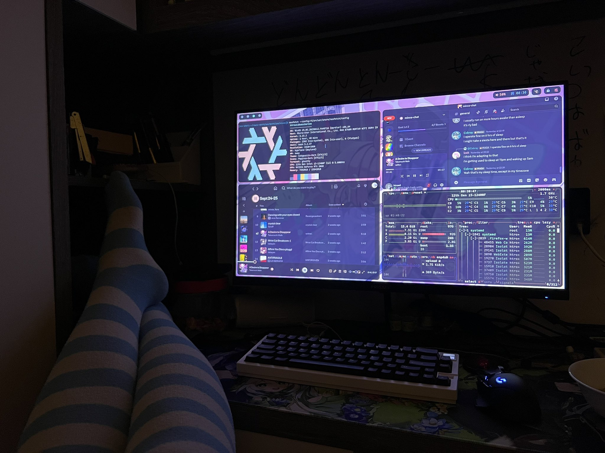

<style>
img {
    display: block !important;
    max-width: min(100%, 600px) !important;
    width: auto !important;
    height: auto !important;
    margin: 1rem auto !important;
    border-radius: 8px;
    box-shadow: 0 2px 8px rgba(0, 0, 0, 0.1);
}

@media (max-width: 600px) {
    img {
        max-width: 95% !important;
        max-height: 300px !important;
        object-fit: contain !important;
    }
}
a {
    word-wrap: break-word !important;
    display: inline-block !important;
    max-width: 100% !important;
    overflow: hidden !important;
    text-overflow: ellipsis !important;
}
</style>

before explaining how I set up my machines, the more important question: [why?](https://scp-wiki.wikidot.com/scp-5000)


## why ??
obviously bc i want to wear programmer socks: 



ok but for real...

nix is {inconvenient, annoying to set up, etc.} but i beg to digress: the main benefit which i will praise about forever is that it frontloads the annoying part and becomes a breeze to reproduce on other machines afterwards.

picture this!: i get a new laptop/pi/other linux device and feel like getting my sick bar and nvim dotfiles setup. how is this doable? i could either

* pacman/apt/emerge/dnf/xbps everything

* write a `install.sh` which ... probably works, but i'm lazy

* learn a new DSL which i can use for shells and other OSes as well (waste time la)

obviously the solution is 3. i dont value my own time. which is where nix comes in.

and what better way other than throw myself into the deep end like I've done so with installing all my other OSes? only the nth time i've done so :p 

## flakes
being an 'experimental' feature only in name, nix Flakes act as a Lockfile / package dot Json. usually you git clone ur dotfiles repo, run `./install.sh`, then forget that there was a breaking change pushed to apt/brew a few months ago for one of ur packages and now everything is on fire :D 

Nix Fixes This™. it allows you to take in an input hash/repo and provide a reproducible way download something! for example, my flake.nix looks like this:

```nix
{
  description = "NixOS and nix-darwin configuration for rowii";

  inputs = {
    nixpkgs.url = "github:nixos/nixpkgs/nixos-unstable";
    nix-darwin = {
      url = "github:nix-darwin/nix-darwin";
      inputs.nixpkgs.follows = "nixpkgs";
    };
    nix-ld.url = "github:Mic92/nix-ld";
    unstable = {
      url = "github:NixOS/nixpkgs/nixos-unstable";
    };
    home-manager = {
      url = "github:nix-community/home-manager";
      inputs.nixpkgs.follows = "nixpkgs";
    };
    LazyVim = {
      url = "github:matadaniel/LazyVim-module";
      inputs.nixpkgs.follows = "nixpkgs";
    };
    ghostty = {
      url = "github:ghostty-org/ghostty";
    };
    hyprland.url = "github:hyprwm/Hyprland";
    spicetify-nix.url = "github:Gerg-L/spicetify-nix";
    quickshell = {
      url = "git+https://git.outfoxxed.me/outfoxxed/quickshell";
      inputs.nixpkgs.follows = "nixpkgs";
    };
    aagl.url = "github:ezKEa/aagl-gtk-on-nix";
    aagl.inputs.nixpkgs.follows = "nixpkgs";
    caelestia-shell = {
      url = "github:caelestia-dots/shell";
      inputs.nixpkgs.follows = "nixpkgs";
    };
  };

  outputs = {
    self,
    nixpkgs,
    nix-darwin,
    home-manager,
    hyprland,
    ghostty,
    nix-ld,
    aagl,
    ...
  } @ inputs: let
    linuxSystem = "x86_64-linux";
    darwinSystem = "aarch64-darwin";
    pkgs = nixpkgs.legacyPackages.${linuxSystem};
    pkgsDarwin = nixpkgs.legacyPackages.${darwinSystem};
  in {
    nixosConfigurations.nixos = nixpkgs.lib.nixosSystem {
      system = linuxSystem;
      specialArgs = {inherit inputs;};
      modules = [
        {
            imports = [ aagl.nixosModules.default ];
            # nix.settings = aagl.nixConfig; # Set up Cachix
            programs.anime-game-launcher.enable = true; # Adds launcher and /etc/hosts rules
            programs.anime-games-launcher.enable = true;
            # programs.honkers-railway-launcher.enable = true;
            # programs.honkers-launcher.enable = true;
            # programs.wavey-launcher.enable = true;
            # programs.sleepy-launcher.enable = true;
        }
        nix-ld.nixosModules.nix-ld
        { programs.nix-ld.dev.enable = true; }
        ({ pkgs, ... }: {
          environment.systemPackages = [
          ghostty.packages.${pkgs.stdenv.hostPlatform.system}.default
        ];
        })
        {
          nixpkgs = {
            config = {
              allowUnfree = true;
              allowUnfreePredicate = (_: true);
              allowAliases = true;
              permittedInsecurePackages = [
                "electron-25.9.0" # Obsidian
                "python-2.7.18.8"
                "beekeeper-studio-5.3.4" # electron 31
              ];
            };
            hostPlatform = linuxSystem;
          };
        }
        ./hosts/configuration.nix
        home-manager.nixosModules.home-manager
        {
          home-manager = {
            useGlobalPkgs = true;
            useUserPackages = true;
            extraSpecialArgs = {inherit inputs;};
            users.ibarahime = import ./home-manager/htrowii.nix;
            backupFileExtension = "backup-" + pkgs.lib.readFile "${pkgs.runCommand "timestamp" { env.when = self.sourceInfo.lastModified; } "echo -n `date '+%Y%m%d%H%M%S'` > $out"}";
          };
        }
      ];
    };

    darwinConfigurations.homura = nix-darwin.lib.darwinSystem {
      system = darwinSystem;
      specialArgs = { inherit inputs; };
      modules = [
        ./darwin/configuration.nix
        home-manager.darwinModules.home-manager
        {
          nixpkgs.config.allowUnfree = true;
        }
        {
          home-manager = {
            useGlobalPkgs = true;
            useUserPackages = true;
            extraSpecialArgs = { inherit inputs; };
            users.ibarahime = import ./darwin-home/ibarahime.nix;
            backupFileExtension = "backup-" + pkgsDarwin.lib.readFile "${pkgsDarwin.runCommand "timestamp" { env.when = self.sourceInfo.lastModified; } "echo -n `date '+%Y%m%d%H%M%S'` > $out"}";
          };
        }
      ];
    };
  };
}
```


here, it provides a easy way to configure both my machines and their home-managers, import repos, and add in programs like a genshin launcher for Linux. quite cool !!

the `inputs.nixpkgs.follows = nixpkgs` in home-manager forces it to use the same version of nixpkgs as the rest of my system which prevents package duplication :D 

ok anyway now back to the actual config
## setup
i initially installed this on my pc at home when i was free for a week and had nothing better to learn! so off i went wiping arch, reading other configs etc. its doable if u have like a week of free time but the main things i wanna talk about is: 

### nix-ld
* this is the most fucking annoying part about nixOS. the problem is that it doesn't adhere to the FHS / filesystem hierarchy standard which. i took for granted but it isn't here. and the problem is that programs not specifically built for nix usually rely on libraries in /usr/lib which is in /nix/store/ symlinked over somewhere else, here:

```bash
➜  ~ ls /run/current-system/sw/lib | head -n10
 alsa-lib -> /nix/store/z8pz8hz2psggqsws4n7mzbbdghpcxm71-pipewire-1.4.9/lib/alsa-lib
 avahi -> /nix/store/d878n04hb47ab8ilx30zrd2xh2mii32v-avahi-0.8/lib/avahi
 bash -> /nix/store/x12lw455sq6qy2wcya85d7rb88ybc3df-bash-interactive-5.3p9/lib/bash
 cmake
 credstore -> /nix/store/5j9cg6adv3d2l403fcfklz4lmf9fd0l8-systemd-258.3/lib/credstore
 cryptsetup -> /nix/store/5j9cg6adv3d2l403fcfklz4lmf9fd0l8-systemd-258.3/lib/cryptsetup
 dri -> /nix/store/k7v2zw4iagq1aymp1n6crwmi1j11yjmw-mesa-25.3.4/lib/dri
 elisa -> /nix/store/vp3z23gjvc8b309yqh47xndzb81d6brw-elisa-25.12.1/lib/elisa
 environment.d -> /nix/store/5j9cg6adv3d2l403fcfklz4lmf9fd0l8-systemd-258.3/lib/environment.d
 firewalld
```

and the solution here is to use a cool thing called nix-ld! and what is does is really really cool, basically it edits the RPATHs / macho Load Command equivalent to patch it to a shim. there's also a env variable that points to nix-ld:

```bash
  ➜  ~ echo $NIX_LD_LIBRARY_PATH
/run/current-system/sw/share/nix-ld/lib
```


### config files vs nix-config
there r 2 ways to configure ur stuff. either you write it all in Nix, or u use a symlink. me personally, i'm lazy and have stuff that i don't want to use Nix on, so i'm choosing to kinda opt out of some of the declarativeness

this can be done using home-manager's config syntax.

for example, my `config.nix` looks like this:

```nix
{ config, lib, pkgs, ... }:

let configDir = ./config;
in
{
  home.file = {
      ".config/btop".source = "${configDir}/btop";
      ".config/kitty".source="${configDir}/kitty";
      ".config/zellij".source = "${configDir}/zellij";
      ".config/ghostty".source="${configDir}/ghostty";
      ".config/spicetify".source="${configDir}/spicetify";
      ".config/nvim".source = config.lib.file.mkOutOfStoreSymlink "${config.home.homeDirectory}/dotfiles/nixos/home-manager/config/nvim";
      ".config/neofetch".source = "${configDir}/neofetch";
      # caelestia dots (broken)
      # ".config/hypr".source = "${configDir}/hypr";
      # ".config/quickshell/caelestia".source = "${configDir}/caelestia-shell";
      ".config/fastfetch".source = "${configDir}/fastfetch";
      ".config/uwsm".source = "${configDir}/uwsm";
      ".zshrc".source = "${configDir}/zsh/.zshrc";

      ".config/quickshell".source = "${configDir}/unused/quickshell";
      ".config/hypr".source = "${configDir}/unused/hypr";
      ".config/swayidle".source = "${configDir}/unused/swayidle";
      ".config/swaylock".source = "${configDir}/unused/swaylock";
      ".config/wlogout".source = "${configDir}/unused/wlogout";
      ".config/waybar".source = "${configDir}/unused/waybar";
      ".config/wofi".source = "${configDir}/unused/wofi";
      ".config/mako".source = "${configDir}/unused/mako";
      ".config/wallpapers".source = "${configDir}/unused/wallpapers";
      ".local/share/fonts".source = config.lib.file.mkOutOfStoreSymlink "${config.home.homeDirectory}/dotfiles/nixos/home-manager/fonts";
      ".config/pipewire/pipewire.conf.d".source = "${configDir}/pipewire/pipewire.conf.d";
  };
}
```

note that nvim, and the fonts use the `mkOutOfStoreSymlink` syntax which basically makes that specific symlink mutable. i usually use lazyvim's sync, which also updates the lockfile. but the lockfile is symlinked from `/nix/store` to `~/.config/nvim`, which is unwritable and thus blows up :D!! github issue [link](https://github.com/LazyVim/LazyVim/issues/174)

```lua
Error executing vim.schedule lua callback: ...local/share/nvim/lazy/lazy.nvim/lua/lazy/manage/lock.lua:12: /home/ibarahime/.config/nvim/lazy-lock.json: Read-only file system  
stack traceback:  
[C]: in function 'assert'  
...local/share/nvim/lazy/lazy.nvim/lua/lazy/manage/lock.lua:12: in function 'update'  
...local/share/nvim/lazy/lazy.nvim/lua/lazy/manage/init.lua:111: in function <...local/share/nvim/lazy/lazy.nvim/lua/lazy/manage/init.lua:110>
```

and the font function is so I can just drop in new fonts and reload cache without rebuilding. lgtm!

## macOS
i only migrated from brew / stow as of verry recently, and there isn't much to do! i'm honestly quite surprised that so many packages in nixpkgs had support for arm64 darwin with the same name!

the only edge cases i faced were w/ my aerospace and sketchybar config
so i usually call bash to update my bar, but again, `/bin/bash` doesn't exist! have to rely on `/etc/profiles/per-user/`

my aerospace config:
```nix
{ pkgs, config, ... }: {
  services.aerospace = {
    enable = true;
    package = pkgs.aerospace;
    # note: binds are stil using skhd because i need right alt
    # good reference: https://github.com/HestHub/nixos/blob/12c664a1800ebec80f38285f87847edf59bdb8e2/modules/darwin/apps.nix#L6
    
    settings = {
      exec-on-workspace-change = [
        "/bin/bash"
        "-c"
        "/etc/profiles/per-user/${config.system.primaryUser}/bin/sketchybar --trigger aerospace_workspace_change FOCUSED_WORKSPACE=\"$AEROSPACE_FOCUSED_WORKSPACE\""
      ];
      
      on-focus-changed = [
        "exec-and-forget /etc/profiles/per-user/${config.system.primaryUser}/bin/sketchybar --trigger aerospace_window_change"
      ];
      
      gaps = {
        inner = {
          horizontal = 10;
          vertical = 10;
        };
        outer = {
          left = 10;
          bottom = 10;
          top = 10;
          right = 10;
        };
      };
    };
  };
}
```

sketchybar had to be fixed in the rc and config files, like this:
```lua
#!/usr/bin/env lua
-- https://github.com/FelixKratz/SketchyBar/issues/553
local script_path = debug.getinfo(1, "S").source:match("@?(.*[/\\])")
package.path = package.path .. ";" .. script_path .. "?.lua;" .. script_path .. "?/init.lua"
require("helpers")
require("init")

-- ...spaces.lua
local LIST_ALL = "/run/current-system/sw/bin/aerospace list-windows --all --format '%{workspace}|%{app-name}'"
-- ...snip
```

### switching
* normally i just alias `nix-rebuild-system` to like `nh switch all --hostname nixos/homura ~/dotfiles/nixos` and it works in the end, actually i do recommend using nh because it visualises the build better :P 


